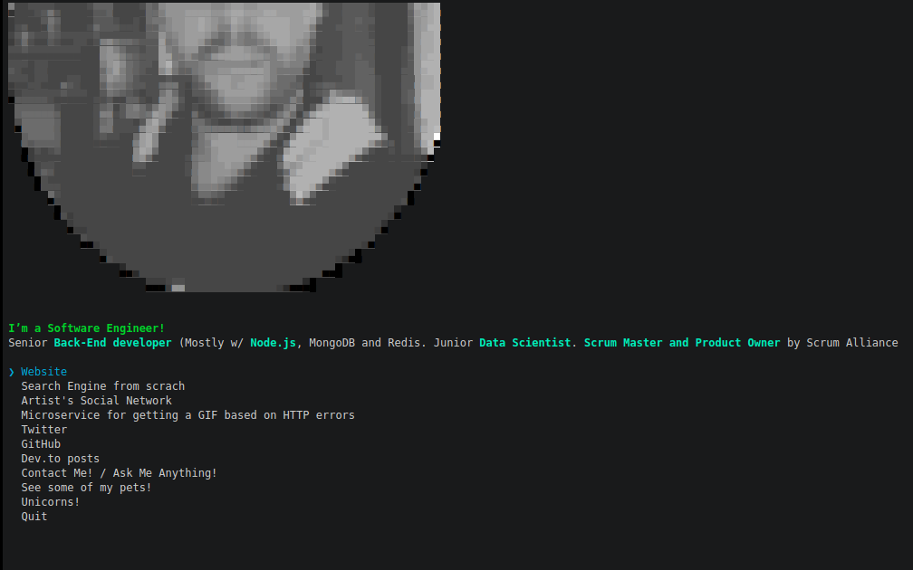

# manuelromero
> The [Manuel Romero (@mrm8488)](https://mrm8488.github.io) CLI



## Motivation
A CLI tool to know more about my work. It is an original way to show what I do and what I like.

## Usage

Install Node.js, then:

```
$ npx manuelromero
```


## Idea

- [Sindre Sorhus CLI](https://github.com/sindresorhus/sindresorhus/blob/master/readme.md)
- [Sindre Sorhus](https://sindresorhus.com)


## Built with

- [ink](https://github.com/vadimdemedes/ink) - React for interactive command-line apps
- [terminal-image](https://github.com/sindresorhus/terminal-image) - Display images in the terminal